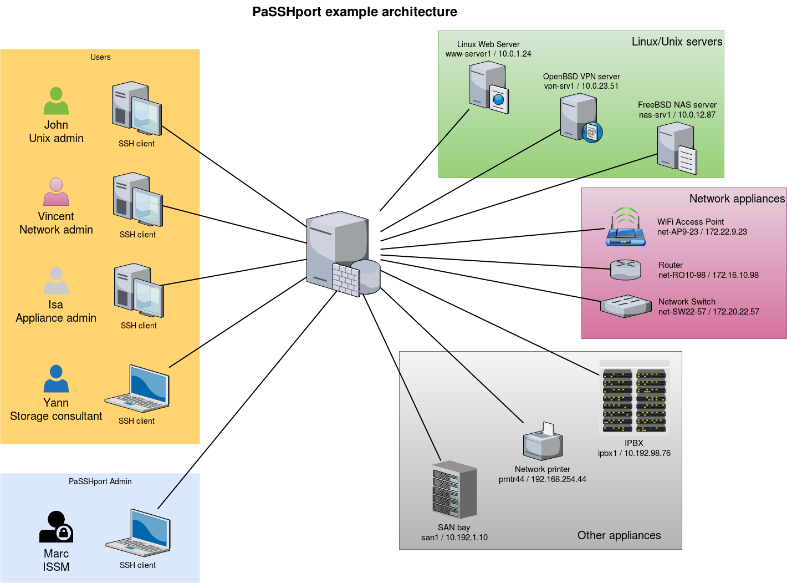
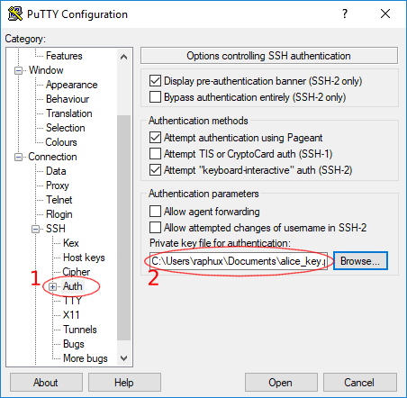
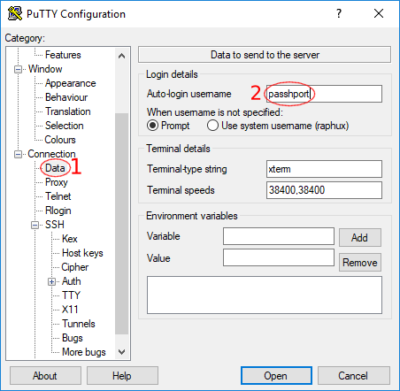
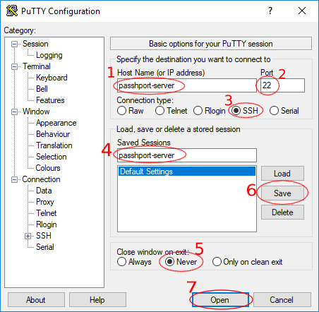
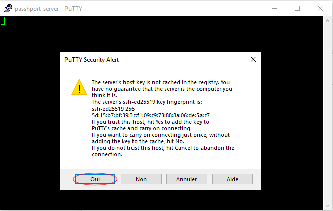
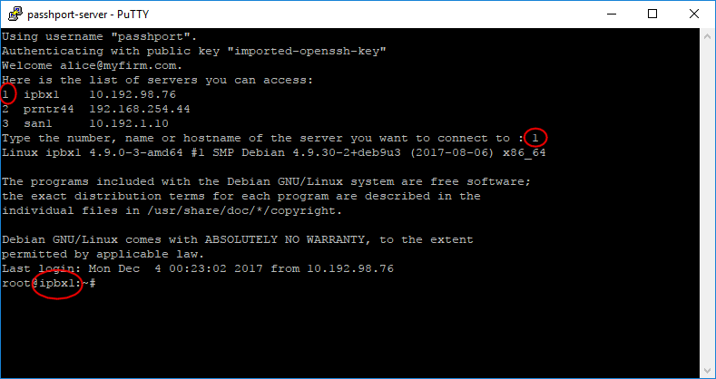

Getting started
###############

So you now have a brand new installation of PaSSHport, but you don't know what to do next…

Example prerequisites
=====================
For this tutorial, we will use the following infos :

* 1 PaSSHport node

We'll use a monolithic installation of PaSSHport : passhportd, passhport and passhport-admin are on the same host.

**3 users**

* John, a linux/unix administrator, who needs to access all linux/unix servers
* Vincent, a network administrator, who needs to access all network appliances
* Alice, a general appliance administrator who needs to access all tier appliances
* Yann, a consultant who's here for a temporary mission about storage infrastructure, that need to access the NAS server and a the SAN bay

**1 PaSSHport admin**

* Marc, the ISSM, who configures PaSSHport, to control all the access rights

**3 types of targets**

* Linux/Unix servers :

 - 1 web server, Linux, www-server / 10.0.1.24
 - 1 VPN server, OpenBSD, vpn-srv1 / 10.0.23.51
 - 1 NAS server, FreeBSD, nas-srv1 / 10.0.12.87

* Network appliances

 - 1 WiFi access points, net-AP9-23 / 172.22.9.23
 - 1 router, net-RO10-98 / 172.16.10.98
 - 1 network switch, net-SW22-57 / 172.20.22.57

* Other appliances

 - 1 IPBX, ipbx1 / 10.192.98.76
 - 1 Network printer, prntr44 / 192.168.254.44
 - 1 SAN bay, san1 / 10.192.1.10

Configure targets
==================
First of all, we'll include the targets into PaSSHport.

Let's connect to your PaSSHport node, and add the linux target. We can do this as passhport user :

.. code-block:: none

  passhport@passhport-server:~$ passhport-admin target create www-server 10.0.1.24
  OK: "www-server" -> created
  passhport@passhport-server:~$

We can check that the target has been well recorded :

.. code-block:: none

  passhport@passhport-server:~$ passhport-admin target list
  www-server
  passhport@passhport-server:~$

Now let's add the other Linux/Unix server :

.. code-block:: none

  passhport@passhport-server:~$ passhport-admin target create vpn-srv1 10.0.23.51
  OK: "vpn-srv1" -> created
  passhport@passhport-server:~$ passhport-admin target create nas-srv1 10.0.23.51
  OK: "nas-srv1" -> created
  passhport@passhport-server:~$

Do the same for the network appliances, and the remaining :

.. code-block:: none

  passhport@passhport-server:~$ passhport-admin target create net-AP9-23 172.22.9.23
  OK: "net-AP9-23" -> created
  passhport@passhport-server:~$ passhport-admin target create net-RO10-98 172.16.10.98
  OK: "net-RO10-98" -> created
  passhport@passhport-server:~$ passhport-admin target create net-SW22-57 172.20.22.57
  OK: "net-SW22-57" -> created
  passhport@passhport-server:~$ passhport-admin target create ipbx1 10.192.98.76
  OK: "ipbx1" -> created
  passhport@passhport-server:~$ passhport-admin target create prntr44 192.168.254.44
  OK: "prntr44" -> created
  passhport@passhport-server:~$ passhport-admin target create san1 10.192.1.10
  OK: "san1" -> created
  passhport@passhport-server:~$

We now have all our targets configured into PaSSHport.

Special target, with a specific login
=========================================================

We want to be able to connect to the SAN bay, as another user, because Yann should not have access to the SAN bay as the root user, but as "admin" user :

.. code-block:: none
  
  root@passhport-server:~# passhport-admin target create
  Name: admin@san1
  Hostname: 10.192.1.10
  Login (default is root): admin
  Port: 22
  SSH Options: 
  Comment: SAN bay, login as admin user, not root.
  OK: "admin@san1" -> created
  root@passhport-server:~#

The SAN will now be accessible through two targets : "san1" and "admin@san1".

Configure target's groups
=========================================================
We'll group the targets we just created into three groups : unices, network and others.

We create the groups : 

.. code-block:: none 

  passhport@passhport-server:~$ passhport-admin targetgroup create unices 
  OK: "unices" -> created
  passhport@passhport-server:~$ passhport-admin targetgroup create network
  OK: "network" -> created
  passhport@passhport-server:~$ passhport-admin targetgroup create others
  OK: "others" -> created
  passhport@passhport-server:~$

Now we put the targets into the corresponding target groups :

.. code-block:: none

  passhport@passhport-server:~$ passhport-admin targetgroup addtarget www-server unices 
  OK: "www-server" added to "unices"
  passhport@passhport-server:~$

I'm a bit lazy, so I'll script the remainings :

.. code-block:: none
  
  passhport@passhport-server:~$ for UNICE in vpn-srv1 nas-srv1; do passhport-admin targetgroup addtarget ${UNICE} unices; done
  OK: "vpn-srv1" added to "unices"
  OK: "nas-srv1" added to "unices"
  passhport@passhport-server:~$ for NETAPPLIANCE in net-AP9-23 net-RO10-98 net-SW22-57; do passhport-admin targetgroup addtarget ${NETAPPLIANCE} network; done
  OK: "net-AP9-23" added to "network"
  OK: "net-RO10-98" added to "network"
  OK: "net-SW22-57" added to "network"
  passhport@passhport-server:~$ for OTHERAPPLIANCE in ipbx1 prntr44 san1; do passhport-admin targetgroup addtarget ${OTHERAPPLIANCE} others; done
  OK: "ipbx1" added to "others"
  OK: "prntr44" added to "others"
  OK: "san1" added to "others"
  passhport@passhport-server:~$

We'll create a last group, that will have all the targets in it (again, I'm gonna script this) :

.. code-block:: none

  passhport@passhport-server:~$ passhport-admin targetgroup create all-targets
  OK: "all-targets" -> created
  passhport@passhport-server:~$ for TARGET in `passhport-admin target list`; do passhport-admin targetgroup addtarget ${TARGET} all-targets; done
  OK: "ipbx1" added to "all-targets"
  OK: "nas-srv1" added to "all-targets"
  OK: "net-AP9-23" added to "all-targets"
  OK: "net-RO10-98" added to "all-targets"
  OK: "net-SW22-57" added to "all-targets"
  OK: "prntr44" added to "all-targets"
  OK: "san1" added to "all-targets"
  OK: "vpn-srv1" added to "all-targets"
  OK: "www-server" added to "all-targets"
  passhport@passhport-server:~$

We're now done with the targets/targetgroups, at least for the moment…

Configure the users
=========================================================

We take it for granted that our users have all created a ssh public key (rsa, dsa or ecdsa), and that they gave us the public part.
We have all the following keys :

Alice, a 2048 bits RSA key :

.. code-block:: none

  ssh-rsa AAAAB3NzaC1yc2EAAAADAQABAAABAQC8JMsMgyRUEMoq31rPTIWpWKgGFQ7fxt5Kray8yzCPga2pohMLstjJeHpWjkVhH8FhRUwCFXOM8zBEykz1IVFjowzFqR9kPvV0fELuIeK/V/42j3izeRH5liXFwotxzfpqTijTxAfj/60IadcUSf5dE8WAiREarrV82ieU5eNZ4FoCH4W0xPS8pEYJDv6hQ8TFHYQCrwHloA3HgzEJgQSFWaS3niMDfNbgbJEOVhXuT2l7pWgSnp1l5jewAq5CB71mMiUyF+zG8FRAYqUKd4VNRN+3/tp+9FEAqGCH3kTuFhFnWCgguQxDxH4XiIj7n2w79ARPzMbn2vTtd+6N0or7 alice@myfirm.com

John, an 521 bits ECDSA key :

.. code-block:: none

  ecdsa-sha2-nistp521 AAAAE2VjZHNhLXNoYTItbmlzdHA1MjEAAAAIbmlzdHA1MjEAAACFBAHTlnhl23T9NiHn06wWaDpT1aJqEY0aOW7E4dfu7kQJsmRqg2SWMld6H8Q+bggwCLSkRKubOWyoJkprAfwOP8OArAGPCIr9PeQfC581EVqaev/yJYbKwwPQEaHpiQoHMaBfsgA2BYS5cNVcrOpLk8nHgKSJGEcdYipbZZxqDrLaeX3lBA== john@myfirm.com

Marc, a 4096 bits RSA key :

.. code-block:: none

  ssh-rsa AAAAB3NzaC1yc2EAAAADAQABAAACAQDFOU5Saf+epkm79BeSniE7VtYMexJeL6BvXUsKUb7m8W4gnD3YTBW93uykO/6ovi9TfYdm+4nKQ9gUGUgzNyD8o7zW8w6wKogoL24UbJKmkZOCU1IgHJSt1QYIs/qHQZ2MR6S6K2f/1J1joYINPtGpQJ475OZfYQbP79fEdRdylupC8L+fvxkka4C0Uxj0I1VjDCVJCjO0md5oXzN75I2aw+RFWuiiL5P/gHRu+2iff2rdhebJZs4ux8u76LQLzYsG9a85Xlagw6N7/aXWnUZ/9gqoF/qVUHfS8ggesTwEJyNnY7EpPcKRUcwnlonn5CIS++Yo8iqjLd93RjFxShUqXlw9Cct4hdh/clW/QYsJRMfN9860mZ9v9dEitM2X1w8HCCD5NAHGqRRrtONM99kZRxmkCQ/Tb+jXvJ+VAl4qffuPPdxY+Bev7wygm4rVnjF2Ac5ioWb4Zd+zIb712VTQDQlRxsu73yWtHSodeSgPpgCWTjCwW/841QbPGkclnE6DKIwQ/vxC0ggSXouc5G6j0gHu90eQ24XL6Gurqr2C11w9saRyzrYRRlS0Ihkp3rMSteVcvrb1Qi4UGmJCHHSBhvP8jRFH4mbdkSGyzsxtjr8puJc8DiQ1UKG3O9X12m8nbOYeNdIofTw615k0YitoQ/60fdEELQyX+kNFQ2VoCw== marc@myfirm.com

Vincent, a 521 bits ECDSA key :

.. code-block:: none

  ecdsa-sha2-nistp521 AAAAE2VjZHNhLXNoYTItbmlzdHA1MjEAAAAIbmlzdHA1MjEAAACFBAHJk+qDLEi283+rUmSek3eEF4PqXYMmQlPTj352w0XO75EGJzfavEDFe0h+Bu39XN/xVc+ypwOb2vv6pcjVsvuHTwHgXR2ElyfE8gGV7mITyXMdDyoWP5N8Ly3s7njNChSL9z3NiG38lg3E4Vg10nbmmoZZCA3WCffV4ugp3lYPnFmtfA== vincent@myfirm.com

And Yann, a 2048 bits RSA key :

.. code-block:: none

  ssh-rsa AAAAB3NzaC1yc2EAAAADAQABAAABAQCs9YpOfP9vgViYa1SSntrydEBLGyWGAr9nvEjqHcMwHQb9JEmhIjvk1ctb8+Kns3/52F0hBrxic6k6UPvvvjbtJX33muFv5dd0k1W4lLcYe4ONTFwLOqCph4Is5r9lbZ5KXxhN/8YC/08jBJow0CoYdc+Yr7MlA51+tEQFwPbuB5vHMUteye0IgmaH9MLzXes/j5BUhnBjDscWVQSvNHY4/PKtHvIdvoI1uKAplstuHI6CDqnb0aJ5P9wME3P1lhRwcVDTm48/AMcfmpp5s+DwOmyDGfGXf+hE0cu7ulAkwHBhR6ciJJg1pz4DqraglxyVyrt+PFq6KDeV/7WwoNEP yann@otherfirm.com
  
With those keys, we can add the users as follow…

* Interactively :

.. code-block:: none
  
  passhport@passhport-server:~$ passhport-admin user create 
  Email (user name): alice@myfirm.com
  SSH Key: ssh-rsa AAAAB3NzaC1yc2EAAAADAQABAAABAQC8JMsMgyRUEMoq31rPTIWpWKgGFQ7fxt5Kray8yzCPga2pohMLstjJeHpWjkVhH8FhRUwCFXOM8zBEykz1IVFjowzFqR9kPvV0fELuIeK/V/42j3izeRH5liXFwotxzfpqTijTxAfj/60IadcUSf5dE8WAiREarrV82ieU5eNZ4FoCH4W0xPS8pEYJDv6hQ8TFHYQCrwHloA3HgzEJgQSFWaS3niMDfNbgbJEOVhXuT2l7pWgSnp1l5jewAq5CB71mMiUyF+zG8FRAYqUKd4VNRN+3/tp+9FEAqGCH3kTuFhFnWCgguQxDxH4XiIj7n2w79ARPzMbn2vTtd+6N0or7 alice@myfirm.com
  Comment: Alice is the general applicance admin
  OK: "alice@myfirm.com" -> created
  passhport@passhport-server:~$

* On a single line, one shot :

.. code-block:: none
  
  passhport@passhport-server:~$ passhport-admin user create john@myfirm.com "ecdsa-sha2-nistp521 AAAAE2VjZHNhLXNoYTItbmlzdHA1MjEAAAAIbmlzdHA1MjEAAACFBAHTlnhl23T9NiHn06wWaDpT1aJqEY0aOW7E4dfu7kQJsmRqg2SWMld6H8Q+bggwCLSkRKubOWyoJkprAfwOP8OArAGPCIr9PeQfC581EVqaev/yJYbKwwPQEaHpiQoHMaBfsgA2BYS5cNVcrOpLk8nHgKSJGEcdYipbZZxqDrLaeX3lBA== john@myfirm.com" --comment="John is the Unices admin. He rocks."
  OK: "john@myfirm.com" -> created
  passhport@passhport-server:~$

We add the others :

.. code-block:: none
  
  passhport@passhport-server:~$ passhport-admin user create marc@myfirm.com "ssh-rsa AAAAB3NzaC1yc2EAAAADAQABAAACAQDFOU5Saf+epkm79BeSniE7VtYMexJeL6BvXUsKUb7m8W4gnD3YTBW93uykO/6ovi9TfYdm+4nKQ9gUGUgzNyD8o7zW8w6wKogoL24UbJKmkZOCU1IgHJSt1QYIs/qHQZ2MR6S6K2f/1J1joYINPtGpQJ475OZfYQbP79fEdRdylupC8L+fvxkka4C0Uxj0I1VjDCVJCjO0md5oXzN75I2aw+RFWuiiL5P/gHRu+2iff2rdhebJZs4ux8u76LQLzYsG9a85Xlagw6N7/aXWnUZ/9gqoF/qVUHfS8ggesTwEJyNnY7EpPcKRUcwnlonn5CIS++Yo8iqjLd93RjFxShUqXlw9Cct4hdh/clW/QYsJRMfN9860mZ9v9dEitM2X1w8HCCD5NAHGqRRrtONM99kZRxmkCQ/Tb+jXvJ+VAl4qffuPPdxY+Bev7wygm4rVnjF2Ac5ioWb4Zd+zIb712VTQDQlRxsu73yWtHSodeSgPpgCWTjCwW/841QbPGkclnE6DKIwQ/vxC0ggSXouc5G6j0gHu90eQ24XL6Gurqr2C11w9saRyzrYRRlS0Ihkp3rMSteVcvrb1Qi4UGmJCHHSBhvP8jRFH4mbdkSGyzsxtjr8puJc8DiQ1UKG3O9X12m8nbOYeNdIofTw615k0YitoQ/60fdEELQyX+kNFQ2VoCw== marc@myfirm.com"
  OK: "marc@myfirm.com" -> created
  passhport@passhport-server:~$ passhport-admin user create vincent@myfirm.com "ecdsa-sha2-nistp521 AAAAE2VjZHNhLXNoYTItbmlzdHA1MjEAAAAIbmlzdHA1MjEAAACFBAHJk+qDLEi283+rUmSek3eEF4PqXYMmQlPTj352w0XO75EGJzfavEDFe0h+Bu39XN/xVc+ypwOb2vv6pcjVsvuHTwHgXR2ElyfE8gGV7mITyXMdDyoWP5N8Ly3s7njNChSL9z3NiG38lg3E4Vg10nbmmoZZCA3WCffV4ugp3lYPnFmtfA== vincent@myfirm.com" --comment="Vincent is the network admin."
  OK: "vincent@myfirm.com" -> created
  passhport@passhport-server:~$ passhport-admin user create yann@otherfirm.com "ssh-rsa AAAAB3NzaC1yc2EAAAADAQABAAABAQCs9YpOfP9vgViYa1SSntrydEBLGyWGAr9nvEjqHcMwHQb9JEmhIjvk1ctb8+Kns3/52F0hBrxic6k6UPvvvjbtJX33muFv5dd0k1W4lLcYe4ONTFwLOqCph4Is5r9lbZ5KXxhN/8YC/08jBJow0CoYdc+Yr7MlA51+tEQFwPbuB5vHMUteye0IgmaH9MLzXes/j5BUhnBjDscWVQSvNHY4/PKtHvIdvoI1uKAplstuHI6CDqnb0aJ5P9wME3P1lhRwcVDTm48/AMcfmpp5s+DwOmyDGfGXf+hE0cu7ulAkwHBhR6ciJJg1pz4DqraglxyVyrt+PFq6KDeV/7WwoNEP yann@otherfirm.com" --comment="Yann is an external consultant, for a temporary mission bout storage infrastructure."
  OK: "yann@otherfirm.com" -> created
  passhport@passhport-server:~$

As you can see above, I forgot to put a comment on "marc@myfirm.com" account. Let's add one :

.. code-block:: none

  passhport@passhport-server:~$ passhport-admin user edit marc@myfirm.com --newcomment="Marc is the ISSM. He access all."
  OK: "marc@myfirm.com" -> edited
  passhport@passhport-server:~$

Users are now created. Let's put them in usergroups…

Configure usergroups :
=========================================================

Even if in this example we only have one user for each purpose of administration, it's generaly a good idea to add a group for one type skill.

Let's add those groups :

.. code-block:: none
  
  passhport@passhport-server:~# passhport-admin usergroup create unices_admins
  OK: "unices_admins" -> created
  passhport@passhport-server:~# passhport-admin usergroup create network_admins
  OK: "network_admins" -> created
  passhport@passhport-server:~# passhport-admin usergroup create appliance_admins
  OK: "appliance_admins" -> created
  passhport@passhport-server:~# passhport-admin usergroup create super_admins
  OK: "super_admins" -> created
  passhport@passhport-server:~# 

We add the users to each corresponding groups :

.. code-block:: none
  
  passhport@passhport-server:~$ passhport-admin usergroup adduser john@myfirm.com unices_admins 
  OK: "john@myfirm.com" added to "unices_admins"
  passhport@passhport-server:~$ passhport-admin usergroup adduser vincent@myfirm.com network_admins 
  OK: "vincent@myfirm.com" added to "network_admins"
  passhport@passhport-server:~$ passhport-admin usergroup adduser alice@myfirm.com appliance_admins 
  OK: "alice@myfirm.com" added to "appliance_admins"
  passhport@passhport-server:~$ passhport-admin usergroup adduser marc@myfirm.com super_admins 
  OK: "marc@myfirm.com" added to "super_admins"
  passhport@passhport-server:~$

Connect usergroups and targetgroups :
=========================================================

We now can connect each usergroups to targetgroups :

.. code-block:: none

  passhport@passhport-server:~# passhport-admin targetgroup addusergroup unices_admins unices 
  OK: "unices_admins" added to "unices"
  passhport@passhport-server:~# passhport-admin targetgroup addusergroup network_admins network 
  OK: "network_admins" added to "network"
  passhport@passhport-server:~# passhport-admin targetgroup addusergroup appliance_admins others 
  OK: "appliance_admins" added to "others"
  passhport@passhport-server:~# passhport-admin targetgroup addusergroup super_admins all-targets 
  OK: "super_admins" added to "all-targets"
  passhport@passhport-server:~#

Special configuration for Yann :
=========================================================

Because Yann is only here for a short mission, and need to access to different targets, that won't be grouped into a targetgroup, so we connect him directly to the targets :

.. code-block:: none

  passhport@passhport-server:~$ passhport-admin target adduser yann@otherfirm.com nas-srv1 
  OK: "yann@otherfirm.com" added to "nas-srv1"
  passhport@passhport-server:~# passhport-admin target adduser yann@otherfirm.com admin@san1 
  OK: "yann@otherfirm.com" added to "admin@san1"
  passhport@passhport-server:~#

As you can see above, we did not give Yann access directly to san1 as root, but as admin user, through the admin@san1 target we created before.

Check rights :
=========================================================

We can check what we configured with the "show" sub-command of passhport-admin :

.. code-block:: none

  passhport@passhport-server:~$ passhport-admin user show marc@myfirm.com 
  Email: marc@myfirm.com
  SSH key: ssh-rsa AAAAB3NzaC1yc2EAAAADAQABAAACAQDFOU5Saf+epkm79BeSniE7VtYMexJeL6BvXUsKUb7m8W4gnD3YTBW93uykO/6ovi9TfYdm+4nKQ9gUGUgzNyD8o7zW8w6wKogoL24UbJKmkZOCU1IgHJSt1QYIs/qHQZ2MR6S6K2f/1J1joYINPtGpQJ475OZfYQbP79fEdRdylupC8L+fvxkka4C0Uxj0I1VjDCVJCjO0md5oXzN75I2aw+RFWuiiL5P/gHRu+2iff2rdhebJZs4ux8u76LQLzYsG9a85Xlagw6N7/aXWnUZ/9gqoF/qVUHfS8ggesTwEJyNnY7EpPcKRUcwnlonn5CIS++Yo8iqjLd93RjFxShUqXlw9Cct4hdh/clW/QYsJRMfN9860mZ9v9dEitM2X1w8HCCD5NAHGqRRrtONM99kZRxmkCQ/Tb+jXvJ+VAl4qffuPPdxY+Bev7wygm4rVnjF2Ac5ioWb4Zd+zIb712VTQDQlRxsu73yWtHSodeSgPpgCWTjCwW/841QbPGkclnE6DKIwQ/vxC0ggSXouc5G6j0gHu90eQ24XL6Gurqr2C11w9saRyzrYRRlS0Ihkp3rMSteVcvrb1Qi4UGmJCHHSBhvP8jRFH4mbdkSGyzsxtjr8puJc8DiQ1UKG3O9X12m8nbOYeNdIofTw615k0YitoQ/60fdEELQyX+kNFQ2VoCw== marc@myfirm.com
  Comment: Marc is the ISSM. He access all.
  Accessible target list: ipbx1 nas-srv1 net-AP9-23 net-RO10-98 net-SW22-57 prntr44 san1 vpn-srv1 www-server

  Details in access:
  Accessible directly: 
  Accessible through usergroups: 
  super_admins: www-server ; vpn-srv1 ; nas-srv1 ; net-AP9-23 ; net-RO10-98 ; net-SW22-57 ; ipbx1 ; prntr44 ; san1 ; 
  Accessible through targetgroups: 
  passhport@passhport-server:~$

As you can see, the "show" sub-command shows how the user has access to each target. We can see above that Marc has access to all the target we configured, because we placed him in the "super_admins" group.

Here is the example for Yann :

.. code-block:: none

  passhport@passhport-server:~$ passhport-admin user show yann@otherfirm.com 
  Email: yann@otherfirm.com
  SSH key: ssh-rsa AAAAB3NzaC1yc2EAAAADAQABAAABAQCs9YpOfP9vgViYa1SSntrydEBLGyWGAr9nvEjqHcMwHQb9JEmhIjvk1ctb8+Kns3/52F0hBrxic6k6UPvvvjbtJX33muFv5dd0k1W4lLcYe4ONTFwLOqCph4Is5r9lbZ5KXxhN/8YC/08jBJow0CoYdc+Yr7MlA51+tEQFwPbuB5vHMUteye0IgmaH9MLzXes/j5BUhnBjDscWVQSvNHY4/PKtHvIdvoI1uKAplstuHI6CDqnb0aJ5P9wME3P1lhRwcVDTm48/AMcfmpp5s+DwOmyDGfGXf+hE0cu7ulAkwHBhR6ciJJg1pz4DqraglxyVyrt+PFq6KDeV/7WwoNEP yann@otherfirm.com
  Comment: Yann is an external consultant, for a temporary mission bout storage infrastructure.
  Accessible target list: nas-srv1 san1

  Details in access:
  Accessible directly: nas-srv1 ; san1 ; 
  Accessible through usergroups: 
  Accessible through targetgroups: 
  passhport@passhport-server:~$

You can see above that Yann has a direct access to targets, not through usergroups, or targetgroups.

Let's connect !
=========================================================

Let's say that I'm John, I connect to PaSSHport, using the id_rsa key that I sent to the PaSSHport admin : 

.. code-block:: none

  john@my-desktop:~$ ssh passhport@passhport-server
  Welcome john@myfirm.com.
  Here is the list of servers you can access:
  1  www-server  10.0.1.24
  2  vpn-srv1    10.0.23.51
  3  nas-srv1    10.0.12.87
  Type the number, name or hostname of the server you want to connect to : 
  
As John, I can see that I can access to 3 servers : www-server, vpn-srv1 and nas-srv1. I can now access to each server, using :

* the number in the first column;
* the name of the server (www-serve…);
* the IP address.
  
.. code-block:: none

  john@my-desktop:~$ ssh passhport@passhport-server
  Welcome john@myfirm.com.
  Here is the list of servers you can access:
  1  www-server  10.0.1.24
  2  vpn-srv1    10.0.23.51
  3  nas-srv1    10.0.12.87
  Type the number, name or hostname of the server you want to connect to : 1
  Linux www-server 4.9.0-3-amd64 #1 SMP Debian 4.9.30-2+deb9u3 (2017-08-06) x86_64
  root@www-server:~#

John is now on the www-server.

Let's say that I'm now Alice, a Windows user. I'm going to use putty to connect to PaSSHport. Let's configure putty…

We launch Putty (you can download it from `here <https://www.chiark.greenend.org.uk/~sgtatham/putty/latest.html>`__), and on the left configuration tree, goes to `Connection -> SSH -> Auth` , then select the ppk key Alice generated (with puttygen for exemple) :

Then we go to `Connection -> SSH -> Data` , and set the login name as passhport :

Finally, we go to the root of the configuration tree `Session` :

* enter the hostname or IP of your PaSSHport server
* enter its SSH port (usually 22)
* select `SSH` as connection type
* enter a name for this connection configuration

For debugging purpose, it may be useful to `Never` close window on exit (so you can see the error message).

Save, and click Open !

If it's the first time we connect to the PaSSHport server, we'll have a window that says the fingerprint is new, and ask us if we want to accept it… Just accept it :

Then we'll have the PaSSHport prompt, and as we want to connect to IPBX, we select `1` :

We are now landed on our target.

Last relevant example, Yann, who access nas-srv1 and san1. He uses a linux laptop :

.. code-block:: none
  
  yann@my-laptop:~$ ssh passhport@passhport-server
  Welcome yann@otherfirm.com.
  Here is the list of servers you can access:
  1  nas-srv1    10.0.12.87
  2  admin@san1  10.192.1.10  SAN bay, login as admin user, not root.
  Type the number, name or hostname of the server you want to connect to :

He can now connect to any of those two servers.

Delete a user
=========================================================

Yann has finished his mission, and left the compagny. There is two way to revoke his access : 

* remove all his target ;
* delete the user.

You may prefer the first way if you know that Yann will may come back later to do another mission, so you won't have to recreate the user (get his ssh key, etc…). Here is how you can delete his access…

First, list his rights :

.. code-block:: none

  passhport@passhport-server:~$ passhport-admin user show yann@otherfirm.com 
  Email: yann@otherfirm.com
  SSH key: ssh-rsa AAAAB3NzaC1yc2EAAAADAQABAAABAQCs9YpOfP9vgViYa1SSntrydEBLGyWGAr9nvEjqHcMwHQb9JEmhIjvk1ctb8+Kns3/52F0hBrxic6k6UPvvvjbtJX33muFv5dd0k1W4lLcYe4ONTFwLOqCph4Is5r9lbZ5KXxhN/8YC/08jBJow0CoYdc+Yr7MlA51+tEQFwPbuB5vHMUteye0IgmaH9MLzXes/j5BUhnBjDscWVQSvNHY4/PKtHvIdvoI1uKAplstuHI6CDqnb0aJ5P9wME3P1lhRwcVDTm48/AMcfmpp5s+DwOmyDGfGXf+hE0cu7ulAkwHBhR6ciJJg1pz4DqraglxyVyrt+PFq6KDeV/7WwoNEP yann@otherfirm.com
  Comment: Yann is an external consultant, for a temporary mission bout storage infrastructure.
  Accessible target list: admin@san1 nas-srv1

  Details in access:
  Accessible directly: nas-srv1 ; admin@san1 ; 
  Accessible through usergroups: 
  Accessible through targetgroups: 
  passhport@passhport-server:~$

You can see that he has access to nas-srv1 and admin@san1, directly. Let's revoke those access :

.. code-block:: none

  passhport@passhport-server:~$ passhport-admin target rmuser yann@otherfirm.com admin@san1 
  OK: "yann@otherfirm.com" removed from "admin@san1"
  passhport@passhport-server:~$ passhport-admin target rmuser yann@otherfirm.com nas-srv1 
  OK: "yann@otherfirm.com" removed from "nas-srv1"
  passhport@passhport-server:~$

Yann won't have access to any target anymore : 

.. code-block:: none

  passhport@passhport-server:~$ passhport-admin user show yann@otherfirm.com 
  Email: yann@otherfirm.com
  SSH key: ssh-rsa AAAAB3NzaC1yc2EAAAADAQABAAABAQCs9YpOfP9vgViYa1SSntrydEBLGyWGAr9nvEjqHcMwHQb9JEmhIjvk1ctb8+Kns3/52F0hBrxic6k6UPvvvjbtJX33muFv5dd0k1W4lLcYe4ONTFwLOqCph4Is5r9lbZ5KXxhN/8YC/08jBJow0CoYdc+Yr7MlA51+tEQFwPbuB5vHMUteye0IgmaH9MLzXes/j5BUhnBjDscWVQSvNHY4/PKtHvIdvoI1uKAplstuHI6CDqnb0aJ5P9wME3P1lhRwcVDTm48/AMcfmpp5s+DwOmyDGfGXf+hE0cu7ulAkwHBhR6ciJJg1pz4DqraglxyVyrt+PFq6KDeV/7WwoNEP yann@otherfirm.com
  Comment: Yann is an external consultant, for a temporary mission bout storage infrastructure.
  Accessible target list: 

  Details in access:
  Accessible directly: 
  Accessible through usergroups: 
  Accessible through targetgroups: 
  passhport@passhport-server:~$

The second option, is to delete the user :

.. code-block:: none
 
  passhport@passhport-server:~$ passhport-admin user delete yann@otherfirm.com 
  Email: yann@otherfirm.com
  SSH key: ssh-rsa AAAAB3NzaC1yc2EAAAADAQABAAABAQCs9YpOfP9vgViYa1SSntrydEBLGyWGAr9nvEjqHcMwHQb9JEmhIjvk1ctb8+Kns3/52F0hBrxic6k6UPvvvjbtJX33muFv5dd0k1W4lLcYe4ONTFwLOqCph4Is5r9lbZ5KXxhN/8YC/08jBJow0CoYdc+Yr7MlA51+tEQFwPbuB5vHMUteye0IgmaH9MLzXes/j5BUhnBjDscWVQSvNHY4/PKtHvIdvoI1uKAplstuHI6CDqnb0aJ5P9wME3P1lhRwcVDTm48/AMcfmpp5s+DwOmyDGfGXf+hE0cu7ulAkwHBhR6ciJJg1pz4DqraglxyVyrt+PFq6KDeV/7WwoNEP yann@otherfirm.com
  Comment: Yann is an external consultant, for a temporary mission bout storage infrastructure.
  Accessible target list: 

  Details in access:
  Accessible directly: 
  Accessible through usergroups: 
  Accessible through targetgroups: 
  Are you sure you want to delete yann@otherfirm.com? [y/N] y
  OK: "yann@otherfirm.com" -> deleted
  passhport@passhport-server:~$ 

Conclusion
=========================================================

You should now be able to use the basic functions of PaSSHport.
